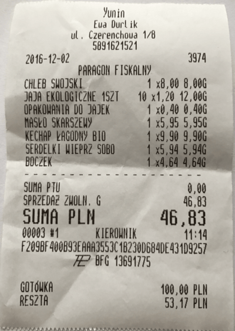

## Mocks, stubs and spies



The purpose of the __bin/console__  script is to make experimenting
with this project easier.

```
spec/
├── integration
│   ├── exchange_money_spec.rb
│   └── report_spec.rb
├── spec_helper.rb
└── unit
    ├── money_spec.rb
    └── product_spec.rb
    └── order_spec.rb

bundle exec rspec
```

The _exchange_rate.csv_ file contains data used in some tests.

| Currency | Exchange Rate |
| -------- | -------------:|
| EUR      | 1.00          |
| PLN      | 4.42          |
| USD      | 4.18          |


### Explore _money.rb_ and _order.rb_ in _irb_

First check if unit test are working.
```sh
bundle exec rspec -fd spec/unit
bundle exec rspec -fd spec/integration # TODO
```

Next run
```sh
bin/console
```

### Experimenting with _Money_

```ruby
pl = Money.new 100, 'PLN'
us = Money.new 100, 'USD'
pl.value
pl.currency
us.currency

pl.to_s
pl * 5
pl + pl

Money.sum [pl, pl * 4]
Money.sum [pl, us, pl]
```


### Experimenting with _Product_

On _bin/console_ run this code.

```ruby
pl = Money.new 10, 'PLN'
order = Order.new 'FOO', '2016-11-28', [pl, pl * 4]
order.total_amount
```

TODO


### Experimenting with _Order_

Do you see problems in the code below?

```ruby
p1 = Product.new 'beer', Money.new(2, 'USD')
p2 = Product.new 'beer', Money.new(9, 'PLN')

order = Order.new 'Biedronka', '2016-11-28', [p1, p2, p1, p1]
Money.sum order.products
```

TODO


## Unit tests

* _money_spec.rb_ – `let`, `subject`
* _order_spec.rb_ – more examples of `let` and `subject`
* _product.rb_ – ensure isolation


## FAQ

1\. _require_ 'something' does not work.

Check `LOAD_PATH` on the command line:
```sh
ruby -e 'puts $LOAD_PATH'
```
or in _irb_:
```ruby
puts $LOAD_PATH
```
